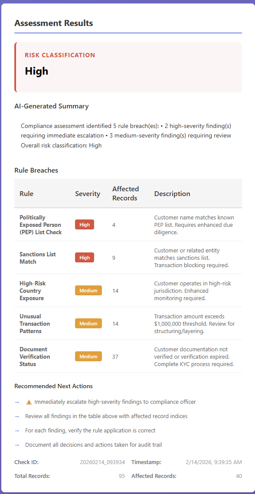
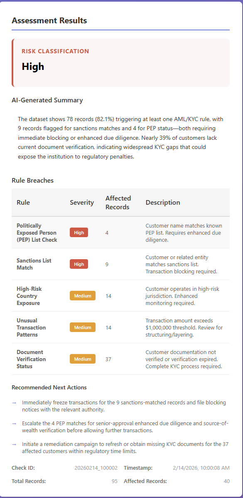

# Compliance-as-a-Service: AML/KYC Assistant PoC

## What This Is

A proof-of-concept system that demonstrates how to apply AI responsibly in regulated financial compliance. It processes customer datasets through AML/KYC screening, combining deterministic rule-based detection with LLM-powered summarization for compliance officers.

**The Problem**: Compliance teams face a scaling dilemma: manual review doesn't scale, but fully automated AI creates regulatory risk because regulators require explainability. Black-box models fail all three regulatory checks (explainability, auditability, governance).

**The Solution**: Split the problem into two parts:
- **Deterministic rules make decisions** (auditable, reproducible, explainable)
- **AI explains those decisions** (useful for humans, but cannot override rules)
- **Humans make final approvals** (accountability remains with compliance officer)

This architecture satisfies regulatory requirements while gaining efficiency benefits of AI.

---

## Design Philosophy

### AI is Assistive, Not Autonomous

The fundamental architectural choice is to **never let AI make compliance decisions**. Instead:

1. **Deterministic rules identify violations** (fully auditable, reproducible)
   - Each finding traces back to specific rule and record index
   - Same data always produces same result
   - Regulators can read the code and understand exactly why a customer was flagged

2. **LLM summarizes findings** (improves usability, adds context)
   - Explains what violations mean in plain English
   - Cannot override rules or reinterpret findings
   - System works without it (graceful degradation)

3. **Humans make final decisions** (accountability remains with compliance officers)
   - Full accountability chain with logging and timestamps
   - Officers can exercise judgment on edge cases
   - Prevents catastrophic failures

### Multi-Step Explicit Workflow

The system follows 5 explicit steps, each independently testable and logged:

1. **Validate**: Check dataset integrity (columns, types, no corruption)
2. **Parse**: Normalize data (dates, names, amounts)
3. **Apply Rules**: Execute 6 deterministic compliance rules
4. **Enrich**: Add context (record indices, affected customer count)
5. **Summarize**: LLM explains findings in plain language (or fallback to rule-based summary)

### Graceful Degradation

The system works even if external services fail:
- **No OpenAI API key?** Uses rule-based summary (still produces valid report)
- **API timeout?** Fallback kicks in automatically
- **No network?** Core rules are local, system still processes files

---

## Why This Design?

Regulators examine three things in compliance systems: **explainability**, **auditability**, **governance**. Black-box AI fails all three. This architecture satisfies all three requirements:

| Aspect | Black-Box AI | This Architecture |
|--------|-------------|------------------|
| **Can you explain it?** | "Model said so" | "Rule X flagged it, see line Y of code" |
| **Can you reproduce it?** | Maybe (model drift) | Always (deterministic rules) |
| **Who's accountable?** | ??? | Compliance officer |

**See [ARCHITECTURE.md](ARCHITECTURE.md) for the detailed technical deep dive**, including implementation details, design decisions, governance considerations, and production roadmap.

---

## Quick Start

### Prerequisites

- Python 3.9+ (tested on 3.11, 3.13)
- pip (comes with Python)
- Git

### Quick Local Run (recommended)

1. Clone the repo and enter it:

```bash
git clone <repo-url>
cd compliance-assistant
```

2. Create and activate a virtual environment:

Windows (Command Prompt):
```cmd
python -m venv venv
venv\Scripts\activate
```

Windows (PowerShell):
```powershell
python -m venv venv
.\venv\Scripts\Activate.ps1
```

macOS / Linux:
```bash
python -m venv venv
source venv/bin/activate
```

3. Install dependencies:

```bash
pip install -r requirements.txt
```

4. (Optional) Create a `.env` file from `env.example` and set any API keys you need:

```bash
# Copy template
cp env.example .env

# Edit .env and set keys, e.g.:
# LLM_PROVIDER=openai
# OPENAI_API_KEY=sk-your-key-here
# HUGGINGFACE_API_KEY=hf_your-token-here
```

On Windows PowerShell you can edit `.env` with Notepad or your editor of choice.

5. Start the server:

```bash
python -m uvicorn app.main:app --reload --host 0.0.0.0 --port 8000
```

6. Open the UI in your browser: `http://localhost:8000`

### Quick Codespaces Run (alternative)

1. Open this repository in GitHub Codespaces.
2. In the Codespace terminal, optionally set API keys and run:

```bash
# Optional in Codespaces
export OPENAI_API_KEY="your-key-here"

python -m uvicorn app.main:app --reload --host 0.0.0.0 --port 8000
```

3. Click "Open in Browser" or visit the forwarded port URL provided by Codespaces.

---

### Environment variables & .env (single place for all OSes)

You can either set environment variables directly in your shell (temporary for the session) or create a `.env` file from `env.example` and edit it. The important variables are:

- `LLM_PROVIDER` — set to `openai`, `huggingface`, or leave empty for rule-based fallback
- `OPENAI_API_KEY` — your OpenAI API key (if using `openai`)
- `HUGGINGFACE_API_KEY` — your HF token (if using `huggingface`)

Temporary (session) examples:

PowerShell (temporary for current session):
```powershell
$env:LLM_PROVIDER = "openai"
$env:OPENAI_API_KEY = "sk-your-key-here"
```

Command Prompt (temporary for current session):
```cmd
set LLM_PROVIDER=openai
set OPENAI_API_KEY=sk-your-key-here
```

Bash / Git Bash / macOS (temporary for current session):
```bash
export LLM_PROVIDER=openai
export OPENAI_API_KEY=sk-your-key-here
```

Persistent via `.env` (cross-shell):

1. Copy `env.example` to `.env`:

```bash
cp env.example .env
```

2. Edit `.env` with your editor and set the values (no `export`/`set` prefixes):

```
LLM_PROVIDER=openai
OPENAI_API_KEY=sk-your-key-here
HUGGINGFACE_API_KEY=
```

3. Restart your terminal or set the variables in the current session from the file:

Bash (load from file for current session):
```bash
set -a; source .env; set +a
```

PowerShell (load from file for current session):
```powershell
Get-Content .env | ForEach-Object {
   if ($_ -and -not $_.StartsWith('#')) {
      $parts = $_ -split '='; $env[$parts[0]] = $parts[1]
   }
}
```

Note: Some deployment environments (e.g., Codespaces, Docker) provide separate UI or config for environment variables—use those for persistent values there.

---

---

## Testing

1. Go to `http://localhost:8000`
2. Drag `sample_data.csv` onto the upload area (or click to browse)
3. Click **Upload & Assess**
4. View findings, risk classification, and AI summary (or rule-based fallback)

**Sample CSV** (create as `sample_customers.csv`):
```csv
customer_name,country,account_open_date,transaction_amount,verification_status
John Smith,Canada,2024-02-01,50000,verified
Jane Doe,Iran,2024-01-15,500000,pending
Vladimir Putin,Russia,2024-02-05,100000,verified
Ahmed Hassan,Syria,2024-02-10,2500000,incomplete
```

**Expected Result**: High risk due to PEP match (Putin) and high-risk countries (Iran, Syria).

---

## LLM Configuration

The system supports multiple LLM providers for summarization, or can work without any (rule-based fallback only).

### AI-Powered vs Rule-Based Summaries

The system generates two types of summaries depending on whether an LLM is configured:

**Without LLM (Rule-Based Fallback):**
- Deterministic, predictable summaries generated from rule logic
- Bullet-point format with severity counts
- Fast (instant), no external API calls needed
- Great for testing, offline use, or cost-sensitive deployments



**With LLM (AI-Powered):**
- Rich, narrative summaries with deeper insights
- Plain-English explanations of implications and context
- Specific, actionable next steps tailored to findings
- Slightly slower (API call overhead) but much more useful for compliance officers



Both approaches:
- Produce the same deterministic rule findings
- Cannot override or reinterpret the rules
- Include full audit trail
- Work with graceful degradation (fallback if LLM fails)

The **first image** (above) shows the rule-based fallback: a concise bullet-point summary with severity breakdown and basic next actions.

The **second image** (above) shows the AI-powered summary: a narrative explanation with specific insights ("78 records triggering at least one AML/KYC rule"), context about what the findings mean, and tailored next actions for each severity tier.

---

### Supported Providers

| Provider | Cost | Best For | Setup |
|----------|------|----------|-------|
| **None (Fallback)** | Free | Testing, PoC, offline | None |
| **OpenAI** | ~$0.001/request | Production, best quality | 5 min |
| **Hugging Face Chat API** | Free tier/paid | Open-source, no vendor lock-in | 5 min |

**Important**: The system **always works** without any LLM. If no provider is configured or the API fails, it automatically uses rule-based summaries.

### Provider Details

**OpenAI (`gpt-3.5-turbo` / `gpt-4o`)**:
- Reliable, high-quality summaries
- Costs ~$0.0005–$0.003 per request
- Fast and well-tested
- Requires active OpenAI account with API credits

**Hugging Face Chat Completions API**:
- Uses OpenAI-compatible Chat Completions endpoint
- Supports multiple open-source models (Llama 2, Mistral, etc.)
- Free tier available with rate limits
- No vendor lock-in (models are open-source)
- Endpoint: `https://router.huggingface.co/v1/chat/completions`

For provider setup, see the `Environment variables & .env` section above — set `LLM_PROVIDER` to `openai` or `huggingface` and add the corresponding API key. If you leave `LLM_PROVIDER` empty, the system will use rule-based fallback.
### Verify It's Working

Check the server logs after uploading a CSV:

```
# ✓ OpenAI was used
[20260214_123456] ✓ LLM (openai) summarization successful. Risk: High

# ✓ Hugging Face was used
[20260214_123456] ✓ LLM (huggingface) summarization successful. Risk: Medium

# ✓ Fallback (no LLM configured or API unavailable)
[20260214_123456] [FALLBACK] Using rule-based summary (LLM unavailable)
```

**See [ARCHITECTURE.md](ARCHITECTURE.md#multi-provider-llm-integration) for detailed LLM configuration and technical details.**

---

## Files & Structure

| File | Purpose |
|------|---------|
| `app/main.py` | FastAPI entry point and upload endpoint |
| `app/services/agent.py` | Multi-step compliance workflow |
| `app/services/rules.py` | 6 deterministic compliance rules |
| `app/services/llm.py` | LLM integration with graceful fallback |
| `app/templates/index.html` | Web UI |
| `ARCHITECTURE.md` | Technical deep dive |

**See [ARCHITECTURE.md](ARCHITECTURE.md) for detailed project structure and service descriptions.**

---

## What's Next (If Moving to Production)

This PoC proves the architecture works. To move toward production:

### Phase 1: Real Compliance Rules
- Connect to real PEP databases (OFAC, UN sanctions lists)
- Implement transaction pattern analysis for money laundering detection
- Integrate external verification services (address validation, ID verification)

### Phase 2: Data Architecture
- Replace single CSV uploads with batch/real-time processing
- Add data warehouse integration
- Implement audit logging to immutable database (7-year retention requirement)

### Phase 3: Regulatory Features
- PDF report export for regulators
- Workflow approvals (compliance officer sign-off)
- Compliance metrics dashboard
- Plain-language rule documentation

### Phase 4: Security & Infrastructure
- Add database (PostgreSQL/MongoDB) for persistence
- Implement role-based access control
- Conduct security audit and penetration testing
- Deploy with authentication (OAuth2/API keys)

### Phase 5: Operations
- Comprehensive logging and monitoring
- Compliance team QA process
- Customer notification and appeals system
- Rule versioning with change audit trail

**See [ARCHITECTURE.md](ARCHITECTURE.md) for detailed production roadmap with phases and timelines.**

---

## Stack

- **FastAPI 0.104+**: Web framework
- **pandas 2.0+**: Data processing
- **pydantic 2.5+**: Data validation
- **OpenAI 1.3+**: LLM integration
- **Python 3.9+**: Language

---

## Support & Troubleshooting

### Common Issues

**"OPENAI_API_KEY not set"**
- System falls back to rule-based summary automatically
- Compliance assessment still works perfectly

**"Port 8000 is already in use"**
```bash
python -m uvicorn app.main:app --host 0.0.0.0 --port 8080
```

**"ModuleNotFoundError: No module named 'fastapi'"**
```bash
pip install -r requirements.txt
```

**See [ARCHITECTURE.md](ARCHITECTURE.md#troubleshooting--support) for more troubleshooting and detailed API reference.**

---

## License

This PoC is provided as-is for educational and demonstration purposes.

---

## Important Disclaimer

**This is a Proof-of-Concept, Not Production Code**

This demonstrates a reference architecture for AI-assisted compliance. Before any production use, you must:

### Regulatory & Legal Review
- Engage compliance and legal teams
- Document how this meets your regulatory requirements (FinCEN, GDPR, etc.)
- Define compliance officer accountability for system decisions
- Establish escalation procedures for edge cases

### Security & Operations
- Conduct security audit and penetration testing
- Implement authentication, authorization, and encryption
- Establish monitoring, alerting, and incident response
- Plan backup, recovery, and capacity scaling

### Data & Compliance
- Implement data protection and privacy controls
- Define data retention policies
- Document rule versioning and change control
- Plan for regulatory audit support

### Testing & Validation
- Validate rule accuracy against real regulatory requirements
- Stress test with realistic data volumes
- Test fallback modes (LLM unavailable, etc.)
- Conduct end-to-end testing with compliance team

### Accountability
Before deploying:
1. **Compliance Officer** must understand and approve all rules
2. **Legal Team** must review regulatory alignment
3. **Security Team** must approve architecture and controls
4. **Operations Team** must plan support and response

**Use this PoC to understand the architecture. Adapt it based on your specific regulatory requirements and risk tolerance.**

---

## Comparison: Our Architecture vs. Black-Box AI

### Scenario 1: How Does It Work?

**With Black-Box AI**: "Um... the model said so? We can't explain it."

**With Our Architecture**: "Rule 002 (Sanctions List Match) flagged customer at record index 1247. Here's the record. Here's the sanctions list. Here's our data source. See line 15 of rules.py where we check it."

### Scenario 2: Customer Disputes the Decision

Customer: "I'm not on any sanctions list!"

**With Black-Box AI**: "Well, the model scored you 0.87... seems pretty high?" (No defense)

**With Our Architecture**: "Record shows your name exactly matched entry XYZ in the sanctions list. You can see it here. You have 10 days to appeal." (Clear, defensible)

### Scenario 3: Fixing a False Positive

Business: "We're getting too many false positives on Rule 4."

**With Black-Box AI**: "Retrain the entire model? Good luck." (Weeks of work, new bugs)

**With Our Architecture**: "Update the $1M threshold to $5M in line 87 of rules.py. Test with historical data. Deploy." (Minutes of work, fully reviewable)

---

## More Information

**For technical implementation details, design decisions, governance considerations, and production roadmap:**

👉 **See [ARCHITECTURE.md](ARCHITECTURE.md)**
